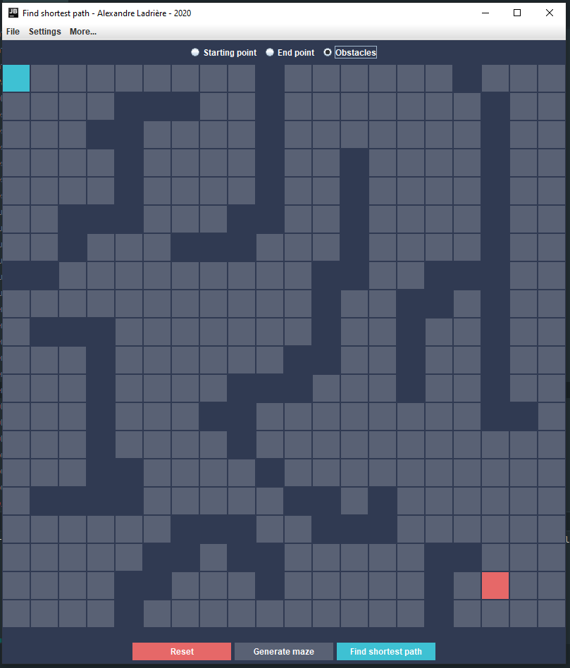
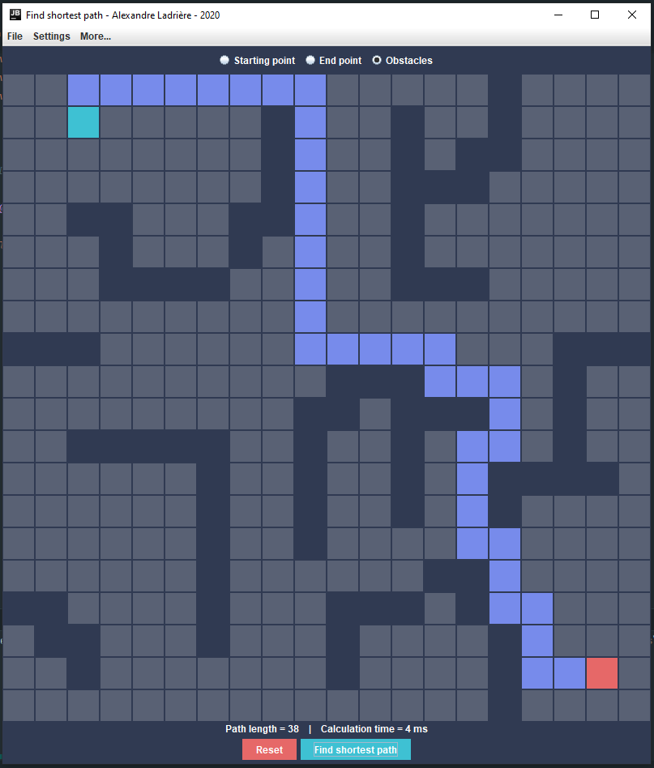
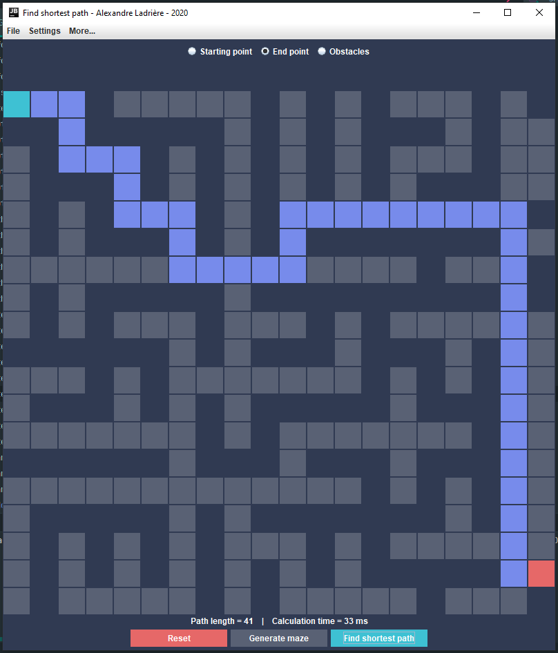
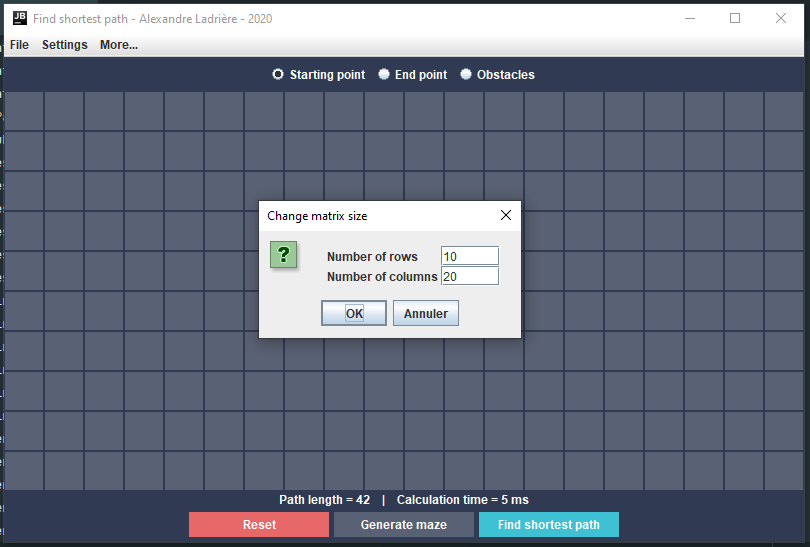

# Shortest-Path (WIP)
[](https://github.com/AlexandreLadriere/Shortest-Path/blob/master/LICENSE)

This project aims to implement some algorithms for finding the shortest path between a starting point and an end point in a matrix with obstacles, and to illustrate the solutions through a graphical interface. You can select where to place the starting point and the end point, as well as the obstacles.
It also implements some algorithms to generate a maze.

For the moment, only the following algorithms have been implemented:
- Find the shortest path:
  - [Breadth-first Search algorithm] (BFS), with and without the possibility to move in diagonals.
- Generate a maze:
  - [Randomized Prim's algorithm]
  - [Depth-first Search algorithm] (DFS)

## How to use
You can compile and run this app by yourself, OR you can use my [make.sh] script:
#### Build all .class files
```shell script
$ sh make.sh build
```

#### Run the app
```shell script
$ sh make.sh run # it will build the app if it is not done yet
```

#### Build JAR file
```shell script
$ sh make.sh build-jar # it will build the app if it is not done yet
```
_Windows users can simply double-click on the [make.sh] to build the jar_

#### Create Javadoc
```shell script
$ sh make.sh doc
```

#### Clean
```shell script
$ sh make.sh clean
```

#### Help
```shell script
$ sh make.sh help
```

## Screenshots
<div align="center">
 
 
 
 
</div>

## License
This project is licensed under the MIT License - see the [LICENSE] file for details.

## Contributing
Contributions are welcome :smile:

### Pull requests
Just a few guidelines:
-   Write clean code with appropriate comments and add suitable error handling.
-   Test the application and make sure no bugs/ issues come up.
-   Open a pull request, and I will be happy to acknowledge your contribution after some checking from my side.

### Issues
If you find any bugs/issues, raise an issue.

  [LICENSE]: <LICENSE>
  [make.sh]: <make.sh>
  [Breadth-first Search algorithm]: <https://en.wikipedia.org/wiki/Breadth-first_search>
  [Randomized Prim's algorithm]: <https://en.wikipedia.org/wiki/Maze_generation_algorithm#Randomized_Prim's_algorithm>
  [Depth-first Search algorithm]: <https://en.wikipedia.org/wiki/Maze_generation_algorithm#Depth-first_search>